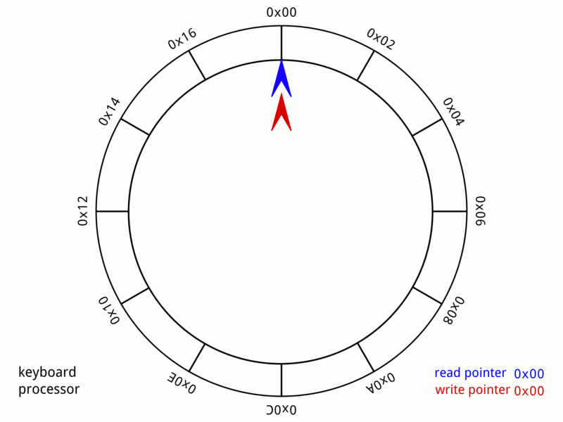
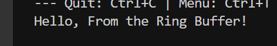

Circular Buffer Demo for ESP32 (Arduino)
=============================================

This project is licensed under the MIT License. See the LICENSE file for details.

This project demonstrates the use of circular buffers for efficient data transfer on the ESP32 board using the Arduino framework. Circular buffers are a type of data structure that stores data in a continuous loop, making them suitable for streaming data and real-time systems.

What is a Circular Buffer?
-------------------------

A circular buffer is an array of constant length that stores data in a continuous loop. Data is read from the buffer in a FIFO (first in, first out) manner, meaning that the oldest data is read first. The terms "circular buffer" and "ring buffer" are often used interchangeably to refer to this type of data structure.

### Benefits
* Store data in a continuous loop
* Read data in a FIFO (First-In-First-Out) manner
* Suitable for streaming data and real-time systems
* Efficient use of memory
* Simple implementation

### Limitations
* Can only store a predetermined maximum number of elements
* Requires knowledge of the maximum size beforehand

## Code Overview
The `ringBufferDemo()` function demonstrates the use of circular buffers for efficient data transfer. It sends a message to the ring buffer, receives data from the ring buffer, and prints the received message to the serial monitor.

## Run on WokWi ESP32 Emulator
https://wokwi.com/projects/396851809084022785

## Local Setup
1. Open the project in the Arduino IDE.
2. Connect your ESP32 board to your computer.
3. Upload the sketch to the board.
4. Open the serial monitor to view the output.

## Portability
This code is written for the ESP32 board using the Arduino framework, but it should be easily translatable to other Arduino boards that support FreeRTOS and the optional FreeRTOS/ringbuf.h component. Additionally, with some modifications, it should also be possible to use this code with ESP-IDF or other platforms that support FreeRTOS.

### Acknowledgments
Thanks to the FreeRTOS team for their contributions to the FreeRTOS project. Also, thanks to the Espressif IDF team for their documentation on FreeRTOS ring buffers. https://docs.espressif.com/projects/esp-idf/en/latest/esp32/api-reference/system/freertos_additions.html
Circular Buffer Animation By MuhannadAjjan - Own work, CC BY-SA 4.0

### Raise an Issue
If you have any questions or issues, please raise an issue on this repository.
